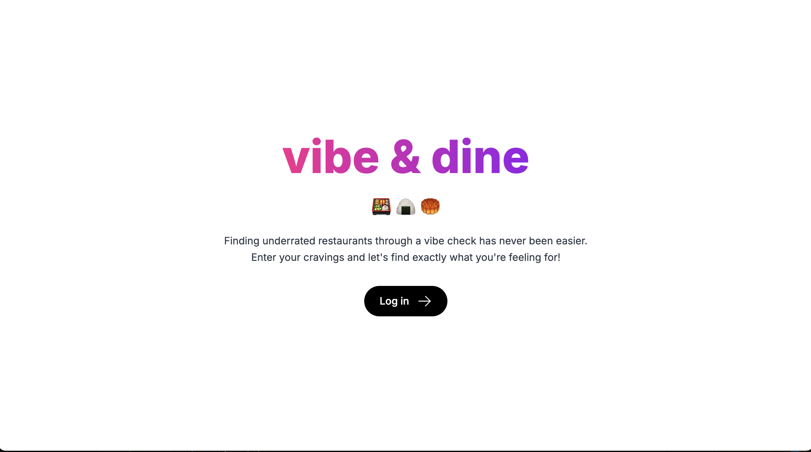
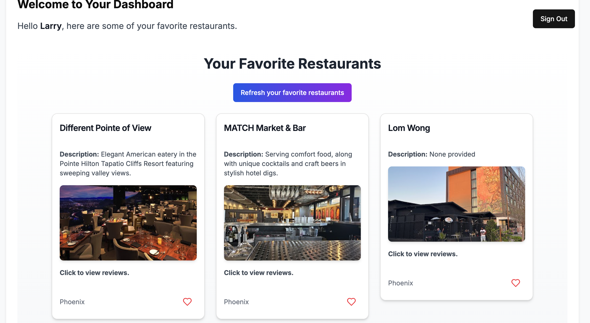
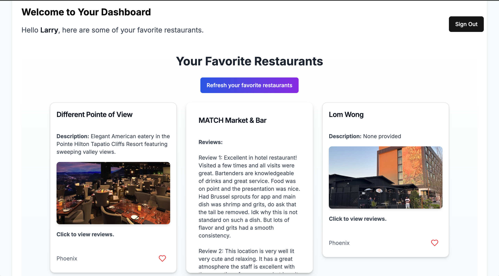
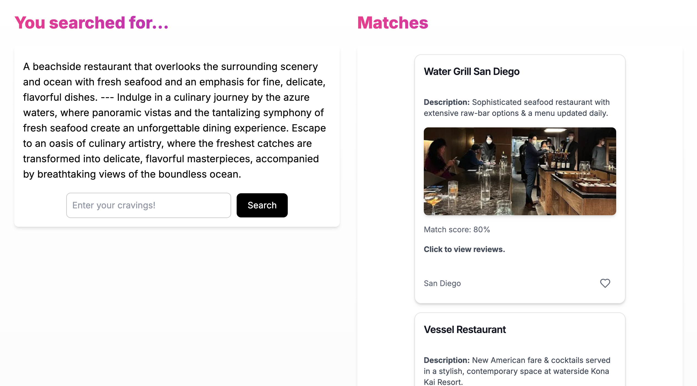

# Vibe n Dine

Where good vibes meets fine taste.

Vibe n Dine is a modern restaurant recommendation system that allows users to search for restaurants based on specific vibes or criteria using natural language. Designed as an exploration of **Next.js** and **novel RAG AI technologies**, this project integrates cutting-edge technologies to deliver an intuitive and powerful experience for users.


<div align="center">
  
  
</div>

<div align="center">
  
  
</div>

## Key Features

- **Natural Language Search**: Utilize advanced vector search to find restaurants that match a user’s desired vibe.
- **Authentication**: Secure user sign-up and login functionality via **Supabase**.
- **Database Integration**: Manage user data, restaurant details, and saved preferences efficiently.
- **Save Favorites**: Users can save and access their favorite restaurants for future reference.

---

## Tech Stack

### Frontend & Backend

- **[Next.js](https://nextjs.org/)**: React-based framework for server-side rendering and static site generation.
- **React.js**: Powering the dynamic and responsive user interface.

### Database

- **[Supabase](https://supabase.com/)**: Provides authentication and database functionality for user data and preferences.
- **[Pinecone](https://www.pinecone.io/)**: Vector database enabling semantic search for restaurant vibes using natural language.

### AI Technologies

- **RAG (Retrieval-Augmented Generation)**: Combines text embeddings and associated restaurant images to enhance the search experience.
- **Vector Search**: Uses embeddings to match user queries with restaurant data.

---

## Getting Started

### Prerequisites

- **Node.js** (v16+)
- **npm** or **yarn**
- Supabase project credentials
- Pinecone API Key

### Installation

1. **Clone the repository**:
   ```bash
   git clone https://github.com/yourusername/vibe-n-dine.git
   cd vibe-n-dine
   ```

2. **Install dependencies**:
   ```bash
   npm install
   ```

3. **Set up environment variables**:
   Create a `.env.local` file in the root directory and add the following:
   ```env
   NEXT_PUBLIC_SUPABASE_URL=your-supabase-url
   NEXT_PUBLIC_SUPABASE_ANON_KEY=your-supabase-anon-key
   PINECONE_API_KEY=your-pinecone-api-key
   ```

4. **Run the development server**:
   ```bash
   npm run dev
   ```
   Access the application at [http://localhost:3000](http://localhost:3000).

---

## How to use

1. **Sign Up or Log In**:
   - Create an account or log in using the secure authentication system powered by Supabase.

2. **Search for Restaurants**:
   - Enter a natural language query describing the vibe or criteria you’re looking for (e.g., "romantic dinner spot with candlelight").

3. **View Results**:
   - Browse through a curated list of restaurants matching your query, complete with descriptions and images.

4. **Save Favorites**:
   - Click on the heart icon to save a restaurant to your favorites for quick access later.

---


## Acknowledgments

Special thanks to the developers and contributors of Next.js, Supabase, Pinecone, and the broader open-source community for making this project possible.


